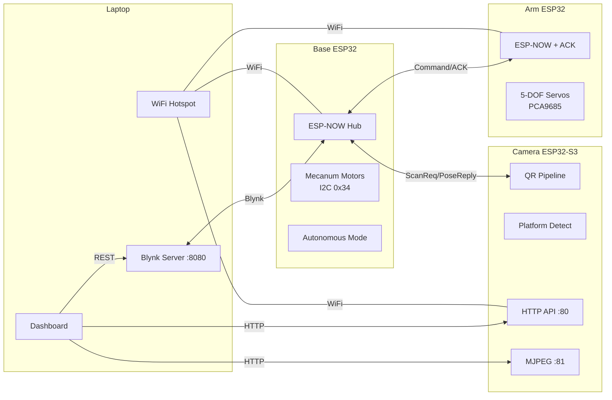

# Glitch Robot — Project Report & Debugging Guide

**Date:** 2026-06-05  
**Status:** ✅ Code-complete — ready for hardware testing when you have boards

---

## What Changed This Session

### Bug Fixed
| Fix | File | What was wrong |
|-----|------|----------------|
| Platform API JSON keys | [main.cpp:1350](camera/src/main.cpp#L1349-L1350) | API sent `width`/`height`/`angle` but dashboard read `width_px`/`height_px`/`angle_deg`. Platform panel showed `undefined`. **Fixed API to send matching keys.** |

### Code Improvements Applied

| ID | Change | Files Modified | Why it matters |
|----|--------|---------------|----------------|
| CI-2 | Arm ISR → loop() flag pattern | [ArmwithBlynk.ino](old/oldBlynkcodes/ArmwithBlynk.ino#L410-L460) | ISR was running full servo sequences (5+ seconds). Now ISR just copies command + sends ACK, loop() does the heavy work. **Prevents missed ESP-NOW packets.** |
| CI-3 | ESP-NOW ACK protocol | [ArmwithBlynk.ino](old/oldBlynkcodes/ArmwithBlynk.ino#L439-L450) + [basewithBlynk.ino](old/oldBlynkcodes/basewithBlynk.ino#L143-L170) | Base now waits 500ms for ACK after sending arm command. Retries once if no ACK. **You'll see `[ARM] No ACK` in Serial if arm doesn't receive commands.** |
| CI-4 | Platform angle estimation | [platform_detect.cpp](camera/src/platform_detect.cpp#L344-L366) | Was hardcoded `0.0f`. Now computes actual rotation from Sobel gradients using double-angle averaging. **Dashboard angle display now shows real values.** |

### Files Archived
Moved to `old md files/`:
- `FINAL_VALIDATION_REPORT.md` — superseded by this report
- `TESTING_VALIDATION_REPORT.md` — superseded by this report  
- `MINIMAX_SOLVED_PROBLEMS.md` — superseded by this report

---

## System Architecture



### Data flow during autonomous mode
```
Base sends ScanRequest → Camera
Camera runs QR pipeline → sends PoseReply back
Base reads yaw_deg → strafes left/right to center
Base reads tz_mm → drives forward until close
Base checks color match → sends arm command (e.g. "RTF")
Arm sends ACK ("ARTF") → executes servo sequence
Base waits 9 seconds → moves to next color target
```

---

## 🔧 Debugging Guide: "When X Happens, Check Y"

This is the most important section. Read it before testing.

### ESP-NOW Problems

| Symptom | Most likely cause | What to check |
|---------|-------------------|---------------|
| `Failed to Add Camera Peer` on base boot | Camera MAC is still `{0x00,...}` placeholder | Update [basewithBlynk.ino:54](file:///d:/Glitch_Codes/Glitch_CodeBase/basewithBlynk.ino#L54) with real MAC from camera Serial |
| `[ARM] No ACK after 500ms` | Arm not powered, wrong MAC, or WiFi channel mismatch | Check arm Serial for `ARM SYSTEM ONLINE`. Verify MACs match. **All 3 boards MUST be on the same WiFi channel** — this happens automatically when connected to same hotspot |
| `ESP-NOW Send Status: FAILED` | Peer not in range, or peer ESP-NOW not initialized | Move boards closer. Check if target board has booted fully |
| Camera never receives scan requests | Base's `cameraAddress` doesn't match camera's actual MAC | Compare `CAMERA MAC:` from camera Serial with `cameraAddress` in base code |
| `[ESPNOW] Send failed` on camera | Base MAC in camera firmware doesn't match actual base | Compare `BASE MAC:` from base Serial with `baseMacAddress` in [main.cpp:68](file:///d:/Glitch_Codes/Glitch_CodeBase/firmware/cam_stream/src/main.cpp#L68) |

> [!TIP]
> **Quick MAC verification:** Boot all 3 boards. Note down what each prints as its own MAC. Then verify:
> - Base's `cameraAddress` = Camera's printed MAC
> - Base's `armAddress` = Arm's printed MAC  
> - Camera's `baseMacAddress` = Base's printed MAC
> - Arm's `baseAddress` = Base's printed MAC

### Motor / Movement Problems

| Symptom | Most likely cause | What to check |
|---------|-------------------|---------------|
| Wheels don't spin at all | I2C bus not connected, motor driver not powered | Check `System Ready` in base Serial. SDA=21, SCL=22. Motor driver needs 12V |
| Wheels spin but robot doesn't move straight | Motor polarity wrong for 1+ motors | Check `REG_MOTOR_PHASE` polarity (line 103). One wrong motor = circle instead of straight |
| Robot overshoots/undershoots distances | Tick constants calibrated for different payload | Re-measure [TICKS_FWD_BWD etc.](file:///d:/Glitch_Codes/Glitch_CodeBase/basewithBlynk.ino#L101-L104) with current robot weight |
| `[ERR] I2C encoder read failed 5 times` | Encoder cable loose, I2C bus noise | Check wiring. Try lower I2C speed (currently 40kHz, safe) |
| Motors keep running after button release | Blynk button not sending 0 on release | Must use "push" mode, not "switch" mode in Blynk app |
| `[WATCHDOG] Auto-stop: move timeout` | Button release event missed by Blynk | Normal safety behavior. 3-second timeout prevents runaway |

### Camera / Vision Problems

| Symptom | Most likely cause | What to check |
|---------|-------------------|---------------|
| `Camera init failed: 0x...` | Wrong pin mapping for your camera board | Verify [GPIO defines in main.cpp:117–132](file:///d:/Glitch_Codes/Glitch_CodeBase/firmware/cam_stream/src/main.cpp#L117-L132) match your hardware |
| QR not detected at all | QR too small, too far, or bad lighting | Get QR within 300mm. Min QR size: 50×50mm. Check `/status` for `qr_fps > 0` |
| QR detected but `decoded=false` | Print quality poor, or QR version too high | Use QR Version 1–3 (max ~25 chars). Print crisp black-on-white |
| `confidence` stays low (< 0.3) | QR at extreme angle or partially occluded | Face QR roughly toward camera. Keep all 3 finder patterns visible |
| Pose `yaw_deg` jumps erratically | Corner detection unstable under motion | Normal during fast movement. Tracker smooths it (check `estimated=true`) |
| Platform detected but `distance_mm` is way off | `PLATFORM_SIZE_MM` doesn't match your platform | Update [platform_detect.h:35](file:///d:/Glitch_Codes/Glitch_CodeBase/firmware/cam_stream/src/platform_detect.h#L35) with actual platform size |
| No detection and no Serial output from camera | Camera crashed (heap exhaustion) | Check `/status` endpoint for `free_heap`. Should be > 30KB |

### Arm Problems

| Symptom | Most likely cause | What to check |
|---------|-------------------|---------------|
| Arm doesn't move on boot | PCA9685 not powered (5V from buck converter, NOT ESP 5V pin) | Check I2C pull-ups. `driver.begin()` must succeed |
| `[!] ERROR: Unreachable` | Target position outside IK bounds | Check [bounds at line 185–191](file:///d:/Glitch_Codes/Glitch_CodeBase/ArmwithBlynk.ino#L185-L191). May need to widen after measuring actual servo range |
| Arm moves to wrong position | Waypoint coordinates don't match physical setup | [posGreen/posBlue/posRed/posRod](file:///d:/Glitch_Codes/Glitch_CodeBase/ArmwithBlynk.ino#L36-L43) are in mm. Measure and adjust |
| Gripper doesn't close | Servo channel or angle wrong | `GRIP_CH=4`, CLOSE=160°, OPEN=30°. Check [lines 30–33](file:///d:/Glitch_Codes/Glitch_CodeBase/ArmwithBlynk.ino#L30-L33) |
| Arm receives command but ACK not received by base | WiFi channel mismatch after reconnect | All boards must stay on same channel. Check `ARM CHANNEL:` and `BASE CHANNEL:` match |

### Dashboard Problems

| Symptom | Most likely cause | What to check |
|---------|-------------------|---------------|
| Camera stream shows black | Wrong camera IP entered | Check Serial for `Connected - IP: 192.168.5.x` and enter that IP |
| "Blynk" badge stays red | Wrong Blynk server IP/port/token | Verify `192.168.5.1:8080` and auth token match |
| Platform panel shows `—` | Camera `/platform` not returning data | Open `http://<cam-ip>/platform` directly in browser |
| Motor speed gauge stays at 0 | Blynk REST API not accessible | Open `http://192.168.5.1:8080/<token>/get/V25` in browser |

### Autonomous Mode Problems

| Symptom | Most likely cause | What to check |
|---------|-------------------|---------------|
| `[AUTO] Camera scan timeout` | Camera not receiving scan requests (MAC mismatch) | See ESP-NOW section above |
| `[AUTO] Camera reported invalid pose` | No QR visible to camera when scan runs | Place QR in camera's field of view |
| `[AUTO] Low confidence, aborting pickup` | QR too far or at bad angle | Threshold is 0.55 at [line 226](file:///d:/Glitch_Codes/Glitch_CodeBase/basewithBlynk.ino#L236). Lower if needed |
| `[AUTO] Color mismatch: expected RED, camera sees GREEN` | Robot approached wrong QR | This is the "accept any" behavior. Decision: retry/abort/accept |
| `[AUTO] Alignment failed for RED, skipping` | Camera couldn't guide alignment | Check camera stream — is QR visible? Is robot too far? |
| Robot strafes but never centers | Yaw threshold too tight for your camera's noise | Increase [YAW_THRESHOLD_DEG](file:///d:/Glitch_Codes/Glitch_CodeBase/basewithBlynk.ino#L234) from 6.0 to 8.0 or 10.0 |
| Robot keeps approaching but never stops | `tz_mm` (distance) inaccurate | Check pose estimation accuracy first in Phase 2. `QR_SIZE_MM` must match real QR |

---

## 📟 Serial Output Decoder

When debugging, you'll see these tags in Serial Monitor. Here's what each means:

### Base ESP32 Serial

| Tag | Meaning | Normal? |
|-----|---------|---------|
| `System Ready` | I2C motor driver initialized | ✅ Must see on boot |
| `WiFi Connected` | Connected to hotspot | ✅ Must see on boot |
| `Blynk LOCAL SERVER connected!` | Blynk TCP connected | ✅ Must see on boot |
| `ESP-NOW READY` | Arm peer added | ✅ Must see on boot |
| `Camera ESP-NOW Peer Added` | Camera peer added | ✅ Must see on boot |
| `[CAM] Pose: valid=1 ...` | Camera sent pose data | ✅ During scans |
| `[CAM] Scan request sent: ... OK` | Base asked camera to scan | ✅ During autonomous |
| `[ARM] Sending: RTF (attempt 1)` | Sending command to arm | ✅ |
| `[ARM] Command confirmed: RTF` | Arm ACK received ✅ | ✅ |
| `[ARM] No ACK after 500ms` | Arm didn't respond | ⚠️ Check arm power/MAC |
| `[AUTO] Starting camera-guided...` | Autonomous mode began | ✅ |
| `[AUTO] Camera scan timeout` | Camera didn't respond in time | ⚠️ Check camera |
| `[WATCHDOG] Auto-stop` | Safety timeout triggered | ⚠️ Check Blynk buttons |
| `[ERR] I2C encoder read failed` | Motor encoder comm lost | ❌ Check wiring |
| `[ERR] Move timed out` | Wheels blocked or stalled | ❌ Physical obstruction |

### Arm ESP32 Serial

| Tag | Meaning | Normal? |
|-----|---------|---------|
| `ARM SYSTEM ONLINE` | Boot complete, home position set | ✅ Must see |
| `ESP-NOW COMMAND RECEIVED: BTC` | Got command from base | ✅ |
| `[ACK] Sent ACK for: BTC` | Acknowledged to base | ✅ |
| `INPUT -> X:... Y:... Z:...` | IK input for move | ✅ |
| `TARGETS -> T1:... T2:...` | Computed servo angles | ✅ |
| `REACHED -> T1:... T2:...` | Move completed | ✅ |
| `[!] ERROR: Unreachable` | IK bounds rejection | ⚠️ Adjust bounds or target |
| `[ERROR] Unknown Command` | Received invalid command string | ❌ Base sending wrong data |

### Camera ESP32-S3 Serial

| Tag | Meaning | Normal? |
|-----|---------|---------|
| `Ready` | Full boot complete | ✅ Must see |
| `CAMERA MAC: xx:xx:xx:xx:xx:xx` | **Copy this** → update base | ✅ Must note down |
| `[QR] grids=1 decoded=1 ...` | QR detected and decoded | ✅ |
| `[POSE] decoded=true ... yaw=...` | Pose estimate computed | ✅ |
| `[ESPNOW] Scan request: task=X` | Base asked for scan | ✅ |
| `[ESPNOW] Sent pose reply ...` | Replied to base | ✅ |
| `[PLATFORM] Detected: cx=...` | Platform found | ✅ |
| `[Health] heap=... psram=...` | 10-second heartbeat | ✅ Watch for heap drop |
| `Camera init failed` | Wrong pin config or camera HW | ❌ Check GPIO defines |
| `quirc_new failed` | Out of memory | ❌ Check PSRAM |
| `[ESPNOW] Send failed` | Can't reach base | ⚠️ Check base MAC |

---

## ⚡ Testing Checklist (With "If It Fails" Guidance)

> [!IMPORTANT]
> Do NOT skip phases. Each phase validates prerequisites for the next.

### Phase 0: Safety (No Power)
- [ ] Inspect wiring for shorts
- [ ] Confirm motor driver = 12V, servos = buck converter (NOT ESP 5V)
- [ ] Camera powered via USB (5V/500mA min)

### Phase 1: Boot (Standalone Nodes)
| Step | Test | If it fails... |
|------|------|----------------|
| 1.1 | Flash camera → see `Ready` + `CAMERA MAC: xx:xx:xx:xx:xx:xx` | Check USB connection, `platformio.ini` board setting |
| 1.2 | Flash arm → see `ARM SYSTEM ONLINE` → arm goes home | Check PCA9685 wiring, I2C address |
| 1.3 | Flash base → update `cameraAddress` with real MAC → reflash | If `Failed to Add Camera Peer`: wrong MAC format |
| 1.4 | Start hotspot → all 3 connect and print IP | Check SSID/password in code. Check hotspot is 2.4GHz (NOT 5GHz) |
| 1.5 | Open `http://localhost:8080/admin` | Start `StartBlynkServer.bat` first. Check Java installed |

### Phase 2: Camera Vision (Base & Arm OFF)
| Step | Test | If it fails... |
|------|------|----------------|
| 2.1 | Open `http://<cam-ip>/stream` → video plays | Wrong IP, or camera init failed |
| 2.2 | Hold QR 300mm away → `/data` shows decoded text | QR too small/far. Try `/status` for `qr_fps` |
| 2.3 | Remove QR → confidence drops → disappears | Working as designed |
| 2.4 | Place black square on white → `/platform` shows `detected:true` | Adjust `PLATFORM_EDGE_THRESHOLD` (160). Check contrast |
| 2.5 | Remove square → `detected:false` | Working as designed |

### Phase 3–5: Integration (Mix of nodes)
Follow [ready_for_implementing.md](file:///d:/Glitch_Codes/Glitch_CodeBase/ready_for_implementing.md) phases 3–5 in order. Use the debugging guide above for troubleshooting.

### Phase 6: Dashboard
| Step | Test | If it fails... |
|------|------|----------------|
| 6.1 | Open `dashboard/index.html` → all panels populate | Check camera IP, Blynk IP/port/token |
| 6.2 | Leave running 5 min → check Camera `/status` heap | If heap drops below 30KB, there's a memory leak |

### Phase 7–10: Autonomous + Stress
Follow [ready_for_implementing.md](file:///d:/Glitch_Codes/Glitch_CodeBase/ready_for_implementing.md). Key things to watch:
- Phase 7: Watch for `[AUTO] Camera scan timeout` — means ESP-NOW isn't working
- Phase 8: Watch Serial for `[ARM] Command confirmed` on each arm move
- Phase 9: Test color mismatch — decide if current "skip" behavior is OK
- Phase 10: Watch camera heap after 10 minutes

---

## ⚠️ Known Quirks & Gotchas

Things that will bite you if you don't know about them:

1. **WiFi must be 2.4GHz** — ESP32 doesn't support 5GHz. If your laptop hotspot defaults to 5GHz, all 3 boards will fail to connect silently.

2. **ESP-NOW channel must match WiFi channel** — This happens automatically when all boards connect to the same hotspot. But if one board fails WiFi and falls back (camera has AP fallback), it'll be on a different channel and ESP-NOW won't work.

3. **Arm blocks during servo sequences** — Even though we moved dispatch to `loop()`, the arm can't accept a new command while executing one (servo moves take 1–5 seconds). This is by design. The base waits 9 seconds after sending an arm command.

4. **`volatile PoseReply` struct copy is not atomic** — `lastPoseReply` is 24 bytes. A new ESP-NOW packet arriving mid-read could give a partially corrupted struct. In practice this is rare (ESP-NOW callback is fast, main loop reads are fast). If you see crazy pose values that don't make sense, this might be why.

5. **Platform `angle_deg` range is [-90°, +90°]** — Due to the double-angle trick, a square at 0° and 90° are equivalent. The angle represents dominant edge direction, not absolute rotation.

6. **Motor speed after reboot is always 25** — The `Motor_speed` default is 25 at [line 106](file:///d:/Glitch_Codes/Glitch_CodeBase/basewithBlynk.ino#L116). If Blynk slider is at a different value, you need to move it to sync.

7. **`autoTrigger` only fires once per toggle** — Pressing V10 ON triggers one autonomous cycle. To run another, toggle OFF then ON again.

---

## 📋 Remaining Config Items (Do When You Have Hardware)

| # | What | Where | How |
|---|------|-------|-----|
| CFG-1 | Camera MAC | [basewithBlynk.ino:54](file:///d:/Glitch_Codes/Glitch_CodeBase/basewithBlynk.ino#L54) | Flash camera → copy MAC from Serial → paste |
| CFG-2 | Verify Arm MAC | [basewithBlynk.ino:39](file:///d:/Glitch_Codes/Glitch_CodeBase/basewithBlynk.ino#L39) | Compare with arm Serial output |
| CFG-3 | Verify Base MAC | [ArmwithBlynk.ino:21](file:///d:/Glitch_Codes/Glitch_CodeBase/ArmwithBlynk.ino#L21) + [main.cpp:68](file:///d:/Glitch_Codes/Glitch_CodeBase/firmware/cam_stream/src/main.cpp#L68) | Compare with base Serial output |
| CFG-4 | WiFi hotspot active | All 3 firmwares | SSID: `hassan's-laptop-hotspot` / Pass: `12345678` |
| CFG-5 | Blynk token matches | [basewithBlynk.ino:24](file:///d:/Glitch_Codes/Glitch_CodeBase/basewithBlynk.ino#L24) | Match with Blynk app project |
| CFG-6 | Laptop IP = 192.168.5.1 | [basewithBlynk.ino:28](file:///d:/Glitch_Codes/Glitch_CodeBase/basewithBlynk.ino#L28) | Run `ipconfig`, update if different |

---

## 📁 Remaining Task List (Simplified)

### Before Testing
- [ ] Flash all 3 boards, collect MACs, update code, reflash base
- [ ] Start Blynk server + hotspot
- [ ] Decide color mismatch behavior (retry / abort / skip)

### During Testing  
- [ ] Run Phases 0→10 from [ready_for_implementing.md](file:///d:/Glitch_Codes/Glitch_CodeBase/ready_for_implementing.md)
- [ ] Watch Serial for the tags listed in the decoder above
- [ ] Calibrate PID tick constants with actual robot weight

### After Testing
- [ ] Expand [README.md](file:///d:/Glitch_Codes/Glitch_CodeBase/README.md) with setup instructions
- [ ] Fine-tune IK bounds based on actual servo range measurements
- [ ] Fine-tune QR confidence threshold based on real lighting conditions

---

*This report supersedes all files in `old md files/`. The authoritative testing sequence is [ready_for_implementing.md](file:///d:/Glitch_Codes/Glitch_CodeBase/ready_for_implementing.md).*
