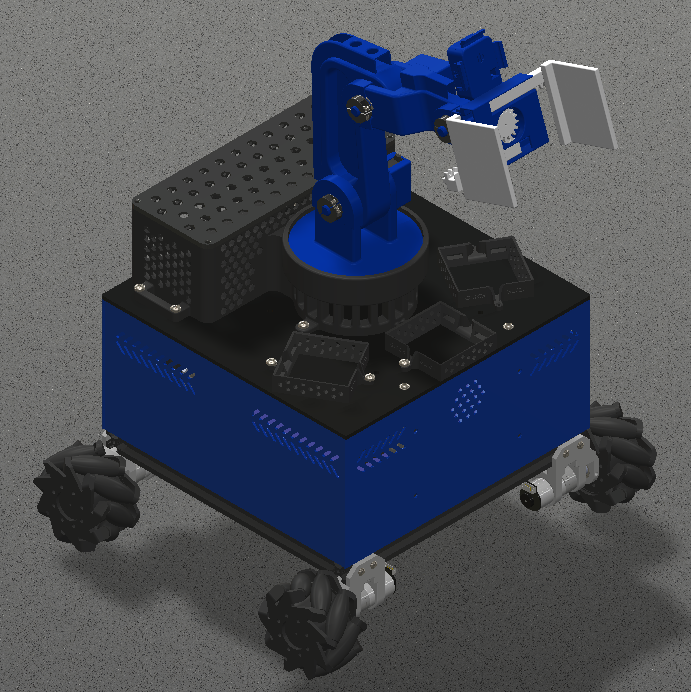
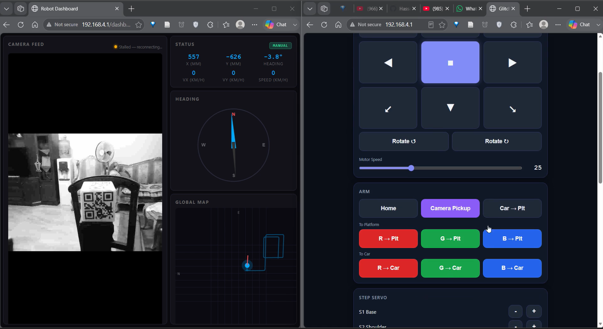
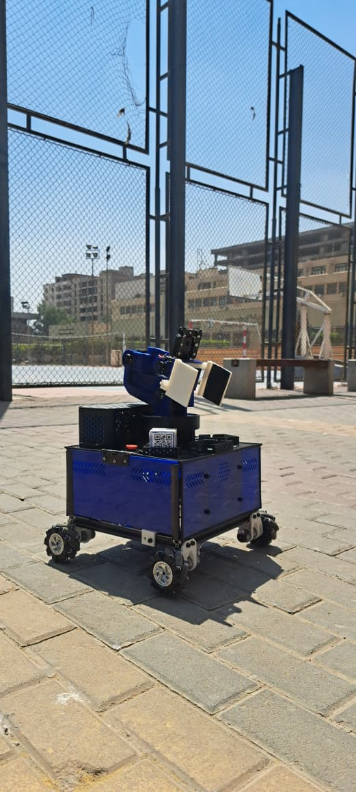
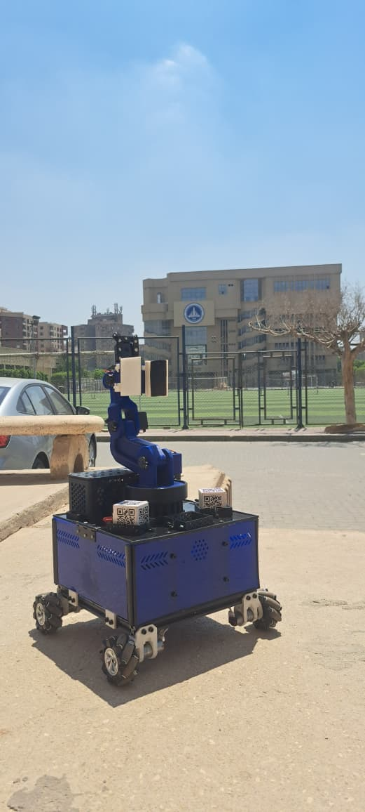

# Glitch

<p align="center">
  
</p>

<p align="center">
  <strong>Omnidirectional Mecanum Wheel Robot with 5-DOF Manipulator Arm & On-Device Computer Vision</strong>
</p>

<p align="center">
  
  
  
  
  
</p>

---

## Overview

Glitch is a competition-grade autonomous robot built on three ESP32 microcontrollers working in concert. It features omnidirectional movement via mecanum wheels, a 5-DOF robotic arm with inverse kinematics, and on-device computer vision for QR code detection, 6-DOF pose estimation, and color-based pick-and-place operations.

The system communicates over ESP-NOW (inter-node) and WebSocket (human-machine), with a web-based dashboard for real-time control and telemetry.

---

## Table of Contents

- [Features](#features)
- [CAD Model](#cad-model)
- [GUI & Dashboard](#gui--dashboard)
- [Gallery](#gallery)
- [System Architecture](#system-architecture)
- [Hardware](#hardware)
- [Repository Structure](#repository-structure)
- [Build & Flash](#build--flash)
- [Communication Architecture](#communication-architecture)
- [Documentation](#documentation)
- [License](#license)

---

## Features

- **Omnidirectional movement** — 4 mecanum wheels with encoder feedback for precise holonomic drive
- **5-DOF robotic arm** — Inverse kinematics solver with smooth trajectory interpolation and gripper control
- **On-device QR detection** — ESP32-S3 + GC2145 camera with multi-pass adaptive binarization
- **6-DOF pose estimation** — Real-time position and orientation tracking from QR codes
- **Temporal tracking** — Exponential confidence decay for occlusion resilience
- **Autonomous color sorting** — Red/Green/Blue QR code classification with camera-guided pickup
- **Web dashboard** — Real-time control, telemetry visualization, and camera MJPEG stream
- **PRBS system identification** — Motor plant model characterization for PID tuning

---

## CAD Model

<p align="center">
  
</p>

The mechanical design features a compact chassis housing four 80mm mecanum wheels, a centrally mounted 5-DOF manipulator arm, and an ESP32-S3 camera module positioned for optimal field of view.

---

## GUI & Dashboard

<p align="center">
  
</p>

The web dashboard provides:
- Real-time motor control and speed gauges
- Camera MJPEG live stream
- QR code detection status and pose data
- Platform detection overlay
- Blynk integration for mobile control
- Autonomous mode toggle and telemetry

---

## Gallery

<table align="center">
  <tr>
    <td align="center">
      <br>
      <em>Image 1</em>
    </td>
    <td align="center">
      <br>
      <em>Image 2</em>
    </td>
  </tr>
</table>

---

## System Architecture

```
                    ┌─────────────────────────────────┐
                    │      Phone/PC Web Browser        │
                    │   (WiFi: GLITCH, ws://192.168.4.1) │
                    └──────────────┬──────────────────┘
                                   │ WebSocket / HTTP
                                   ▼
┌─────────────────────────────────────────────────────────────────┐
│                      BASE NODE (ESP32)                          │
│  WiFi AP ─ AsyncWebServer ─ ESP-NOW Hub ─ I2C Motor Control    │
│  MPU6050 IMU ─ Heading PID ─ Mecanum Mixing ─ Encoder Feedback │
└───────────────────────────────────┬─────────────────────────────┘
                                    │ ESP-NOW
                    ┌───────────────┴───────────────┐
                    ▼                               ▼
        ┌───────────────────┐             ┌──────────────────┐
        │   ARM NODE (ESP32)│             │ CAMERA NODE      │
        │   WebSocket Client│             │ (ESP32-S3)       │
        │   5-DOF IK Solver │             │ QR Detection     │
        │   PCA9685 Servos  │             │ Pose Estimation  │
        │   Trajectory Gen  │             │ MJPEG Streaming  │
        └───────────────────┘             └──────────────────┘
```

---

## Hardware

| Component | Specification |
|-----------|--------------|
| Base MCU | ESP32-WROOM-32 (Dual-core Xtensa LX6 @ 240MHz) |
| Arm MCU | ESP32-WROOM-32 (same as Base) |
| Camera MCU | ESP32-S3-WROOM-1 (Xtensa LX7 @ 240MHz, 8MB PSRAM) |
| Motor Driver | Hiwonder MD02 (I2C 0x34, 4x DC motors + encoders) |
| Servo Driver | PCA9685 (I2C 0x40, 16-ch PWM, 12-bit) |
| Camera | GC2145 (2MP, DVP interface, 62° FOV) |
| IMU | MPU6050 (6-axis, DMP for yaw heading) |
| Wheels | 4x Mecanum (80mm diameter, 1980 ticks/rev) |

---

## Repository Structure

```
Glitch_CodeBase/
├── base.cpp                    # Base ESP32 firmware (WiFi AP, ESP-NOW, motors, IMU)
├── arm/
│   └── arm.cpp                 # Arm ESP32 firmware (WebSocket, IK, servos)
├── camera/
│   ├── src/
│   │   ├── main.cpp            # Camera ESP32-S3 firmware (QR, pose, ESP-NOW)
│   │   ├── platform_detect.cpp # Platform detection (Sobel edge-based)
│   │   └── arm_pose_link.cpp   # Camera-to-arm pose forwarding
│   └── lib/quirc/              # QR code decoding library
├── SystemIdentification/
│   ├── PRBS_Enhanced/
│   │   ├── PRBS_Enhanced.ino   # Enhanced PRBS motor identification firmware
│   │   └── platformio.ini      # Standalone build config
│   └── analysis/
│       ├── sysid_capture.py    # Serial data capture
│       ├── sysid_analysis.py   # Transfer function estimation
│       ├── sysid_bode.py       # Bode plot generation
│       ├── sysid_validation.py # Model validation
│       └── requirements.txt    # Python dependencies
├── PRBS_Testing/               # PRBS testing scripts and data
├── docs/
│   ├── ARCHITECTURE_DESIGN.md  # System architecture & design choices
│   ├── COMMUNICATION_PROTOCOLS.md  # Protocol specifications
│   ├── API_REFERENCE.md        # API documentation
│   ├── ALGORITHMS_IMPLEMENTATION.md # Algorithm details
│   └── SYSTEM_IDENTIFICATION.md # SysID methodology
├── assets/                     # Images and media files
├── old/                        # Archived/superseded files
├── platformio.ini              # PlatformIO build configuration
├── NODES.md                    # ESP32 node registry & MAC addresses
└── GLITCH_COMPREHENSIVE_REPORT.md  # Project report & debugging guide
```

---

## Build & Flash

### Prerequisites

- [PlatformIO CLI](https://platformio.org/install/cli) or VS Code + PlatformIO extension
- Python 3.8+ (for analysis scripts)
- ESP32 development board connected via USB

### Firmware Environments

```bash
# Base node
pio run -e base -t upload

# Arm node
pio run -e arm -t upload

# Camera node (from camera/ directory)
cd camera && pio run -t upload

# PRBS system identification (from SystemIdentification/PRBS_Enhanced/)
cd SystemIdentification/PRBS_Enhanced && pio run -t upload
```

### System Identification Analysis

```bash
cd SystemIdentification/analysis
pip install -r requirements.txt

# Capture data
python sysid_capture.py COM15 115200 prbs_motor0.csv

# Analyze
python sysid_analysis.py prbs_motor0.csv

# Generate Bode plots
python sysid_bode.py prbs_motor0_model.json

# Validate
python sysid_validation.py prbs_motor0.csv prbs_motor0_model.json
```

---

## Communication Architecture

| Layer | Protocol | Path | Purpose |
|-------|----------|------|---------|
| Human-Machine | WebSocket | Phone <-> Base | Real-time control & telemetry |
| Inter-Node | ESP-NOW | Base <-> Camera | QR pose data (23 bytes) |
| Inter-Node | WebSocket | Base <-> Arm | Arm commands & status |
| Actuator | I2C (400kHz) | Base -> Motor | Mecanum wheel control |
| Actuator | I2C (400kHz) | Arm -> PCA9685 | Servo PWM control |

### ESP-NOW Packet Types

| Packet | Direction | Size | Purpose |
|--------|-----------|------|---------|
| `ScanRequest` | Base -> Camera | 4B | Trigger QR/platform scan |
| `PoseReply` | Camera -> Base | 23B | Return QR pose + confidence |
| `CameraPoseData` | Base -> Arm | 23B | Forward pose for IK |
| `ArmStatus` | Arm -> Base | 4B | Report busy/idle state |

### Node Configuration

| Node | WiFi Mode | Channel | IP |
|------|-----------|---------|-----|
| Base | AP | 11 | 192.168.4.1 |
| Arm | STA | 11 | DHCP |
| Camera | STA | 11 | DHCP |

---

## Documentation

| Document | Description |
|----------|-------------|
| [Architecture Design](docs/ARCHITECTURE_DESIGN.md) | System architecture, hardware/software design, trade-offs |
| [Communication Protocols](docs/COMMUNICATION_PROTOCOLS.md) | ESP-NOW, WebSocket, HTTP, I2C specifications |
| [API Reference](docs/API_REFERENCE.md) | WebSocket commands, HTTP endpoints, I2C register map |
| [Algorithms](docs/ALGORITHMS_IMPLEMENTATION.md) | QR detection, IK solver, mecanum kinematics, tracking |
| [System Identification](docs/SYSTEM_IDENTIFICATION.md) | PRBS methodology, motor plant characterization |
| [Node Registry](NODES.md) | ESP32 MAC addresses, IP assignments, re-verify procedures |
| [Comprehensive Report](GLITCH_COMPREHENSIVE_REPORT.md) | Project report, debugging guide, testing checklist |

---

## License

Academic/educational project. See individual library licenses for third-party dependencies.

---

<p align="center">
  Built with <strong>ESP32</strong>, <strong>PlatformIO</strong>, and a lot of solder.
</p>
