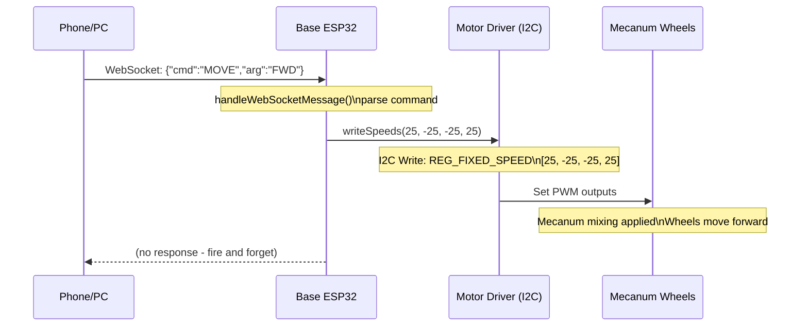
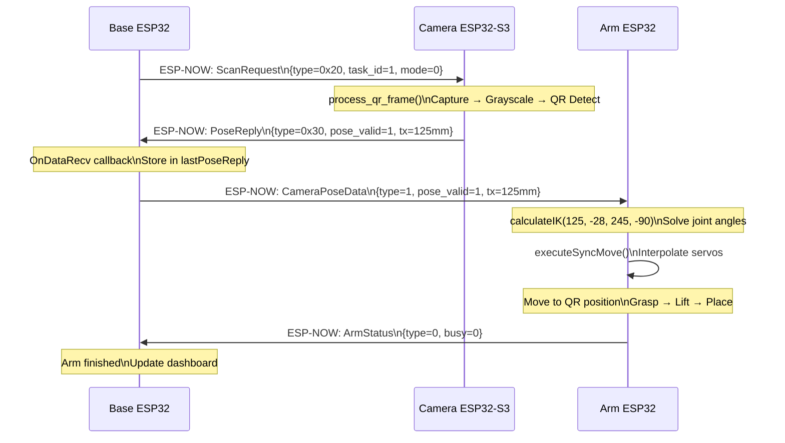
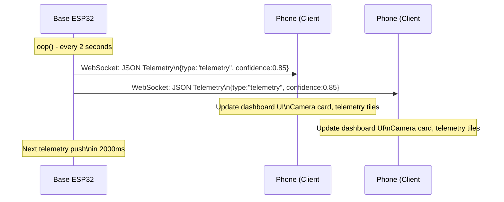
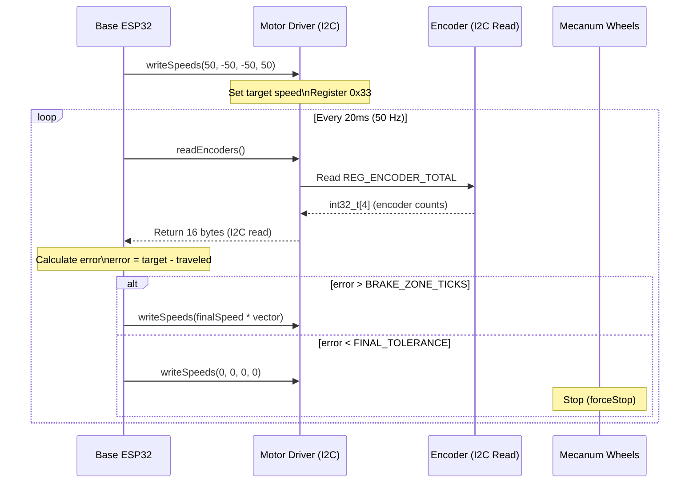
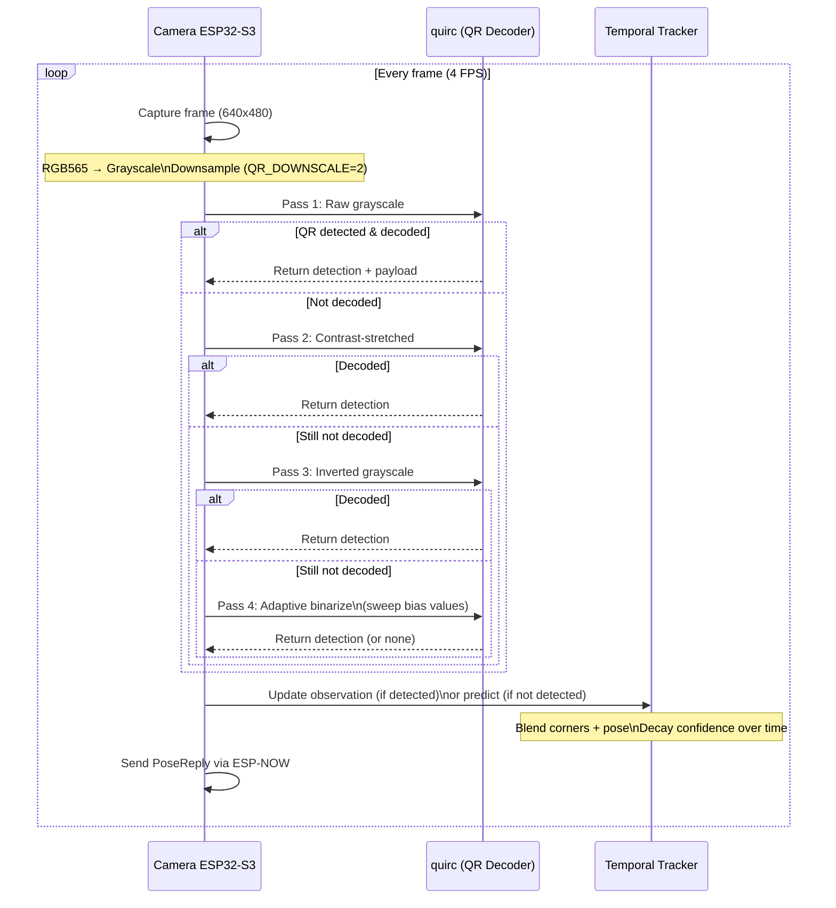
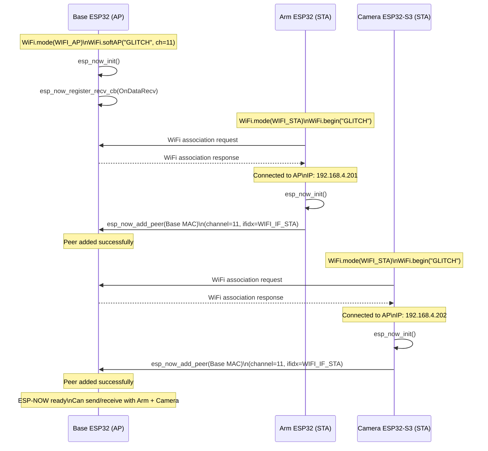
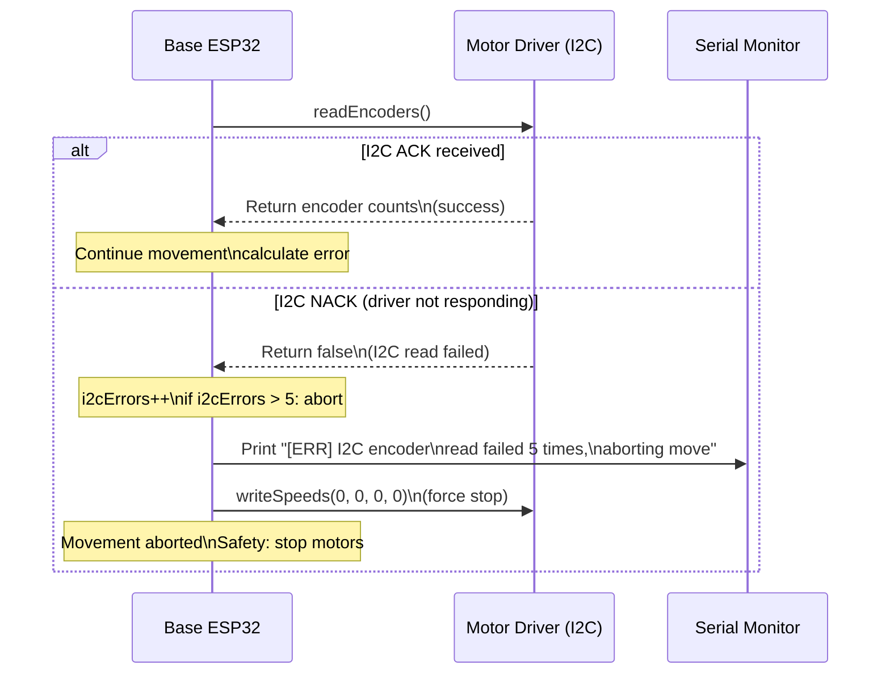

# Glitch Robot - API Reference

## Academic/Industrial Documentation

**Version:** 2.0  
**Date:** 2026  
**Project:** Glitch - Omnidirectional Mecanum Wheel Robot with Computer Vision

---

## Table of Contents

1. [WebSocket API](#websocket-api)
2. [ESP-NOW Protocol](#esp-now-protocol)
3. [HTTP Endpoints](#http-endpoints)
4. [I2C Interface](#i2c-interface)
5. [Error Codes](#error-codes)
6. [Example Flows](#example-flows)

---

## WebSocket API

### Connection Details

| Parameter | Value |
|-----------|-------|
| **Endpoint** | `ws://192.168.4.1/ws` |
| **Protocol** | RFC 6455 (WebSocket) |
| **Transport** | WebSocket over HTTP upgrade |
| **Max Clients** | 8 (AsyncWebSocket limit) |
| **Ping/Pong** | Automatic (built-in to AsyncWebServer) |

---

### Message Format

All messages use **JSON** format.

#### Client → Server (Commands)

```json
{
    "cmd": "<COMMAND_TYPE>",
    "arg": "<ARGUMENT_VALUE>"
}
```

**Required Fields:**
- `cmd` (string): Command category
- `arg` (string): Command parameter

---

#### Server → Client (Responses)

**Telemetry Update:**
```json
{
    "type": "telemetry",
    "confidence": 0.85,
    "yaw": 12.5,
    "color": "RED",
    "distance_mm": 250,
    "tx_mm": 120.0,
    "ty_mm": -30.0,
    "motor_speed": 25,
    "free_heap": 45000,
    "autonomous": false,
    "connected": true
}
```

**QR Detection Result:**
```json
{
    "type": "qr_result",
    "pose_valid": 1,
    "color": 1,
    "color_name": "RED",
    "confidence": 0.92,
    "tx_mm": 125.0,
    "ty_mm": -28.0,
    "tz_mm": 245.0,
    "yaw_deg": 11.5,
    "estimated": 0,
    "qr_msg": "https://example.com"
}
```

**Arm Status Update:**
```json
{
    "type": "arm_status",
    "busy": true
}
```

---

### Command Reference

#### 1. Movement Commands (`cmd: "MOVE"`)

**Purpose:** Control mecanum wheel base movement.

| `arg` Value | Movement | Vector | Speed Range |
|--------------|-----------|---------|-------------|
| `"FWD"` | Forward | `[1, -1, -1, 1]` | 0-100 |
| `"BACK"` | Backward | `[-1, 1, 1, -1]` | 0-100 |
| `"LEFT"` | Strafe left | `[-1, -1, -1, -1]` | 0-100 |
| `"RIGHT"` | Strafe right | `[1, 1, 1, 1]` | 0-100 |
| `"ROTCW"` | Rotate clockwise | `[1, -1, 1, -1]` | 0-100 |
| `"ROTCCW"` | Rotate counter-clockwise | `[-1, 1, -1, 1]` | 0-100 |
| `"DIAGFR"` | Diagonal forward-right | `[1, 0, 0, 1]` | 0-100 |
| `"DIAGFL"` | Diagonal forward-left | `[0, -1, -1, 0]` | 0-100 |
| `"DIAGBR"` | Diagonal backward-right | `[0, 1, 1, 0]` | 0-100 |
| `"DIAGBL"` | Diagonal backward-left | `[-1, 0, 0, -1]` | 0-100 |
| `"STOP"` | Emergency stop | `[0, 0, 0, 0]` | N/A |

**Example:**
```json
{"cmd": "MOVE", "arg": "FWD"}
```

**Response:** None (motor command sent via I2C)

---

#### 2. Step Movement Commands (`cmd: "STEP"`)

**Purpose:** Move fixed distance (position-controlled).

**Behavior:**
- Moves specified distance at `Motor_speed` speed
- Uses encoder feedback for closed-loop control
- Non-blocking (returns immediately, executes in background)

| `arg` Value | Distance | Tick Constant |
|--------------|----------|---------------|
| `"FWD"` | 50 mm | `TICKS_FWD_BWD` (5540) |
| `"BACK"` | 50 mm | `TICKS_FWD_BWD` (5540) |
| `"LEFT"` | 50 mm | `TICKS_STRAFE` (6253) |
| `"RIGHT"` | 50 mm | `TICKS_STRAFE` (6253) |
| `"ROTCW"` | 15° | `TICKS_ROTATE` (7200) |
| `"ROTCCW"` | 15° | `TICKS_ROTATE` (7200) |

**Example:**
```json
{"cmd": "STEP", "arg": "FWD"}
```

**Response:** None (movement executed in `loop()`)

---

#### 3. Speed Setting (`cmd: "SPEED"`)

**Purpose:** Adjust motor speed for all movement commands.

**Range:** 0-80 (constrained in JavaScript, 0-100 in firmware)

**Example:**
```json
{"cmd": "SPEED", "arg": "50"}
```

**Effect:** Updates `Motor_speed` global variable (used by all movement functions)

---

#### 4. Arm Commands (`cmd: "ARM"`)

**Purpose:** Control robotic arm (5-DOF).

| `arg` Value | Function | IK Target | Description |
|--------------|----------|-----------|-------------|
| `"H"` | Home | `(0, 90, 150, -20)` | Move to home position |
| `"S"` | Scan pose | `(0, 150, 200, -45)` | Move to camera scan pose |
| `"GTC"` | Green to Car | `posGreen` | Pick green from floor, place on car |
| `"BTC"` | Blue to Car | `posBlue` | Pick blue from floor, place on car |
| `"RTC"` | Red to Car | `posRed` | Pick red from floor, place on car |
| `"GTF"` | Green to Floor | `posGreen` | Place green on floor |
| `"BTF"` | Blue to Floor | `posBlue` | Place blue on floor |
| `"RTF"` | Red to Floor | `posRed` | Place red on floor |
| `"CTP"` | Car to Platform | `posRod` | Move to rod position |
| `"CAM_PICKUP"` | Camera-guided pickup | From camera pose | Use QR pose for IK |

**Example:**
```json
{"cmd": "ARM", "arg": "H"}
```

**Response:** Arm node receives command via ESP-NOW

---

#### 5. Single-Step Servo (`cmd: "SSTEP"`)

**Purpose:** Manually adjust individual servo by small angle.

**Format:** `"SSTEP": "<JOINT>,<ANGLE>"`

| Joint Index | Servo | Range |
|-------------|--------|-------|
| `J1` | Base rotation | 0-180° |
| `J2` | Shoulder | 10-170° |
| `J3` | Elbow | 10-170° |
| `J4` | Wrist pitch | 50-180° |
| `J5` | Gripper | 30-160° (open-close) |

**Example:**
```json
{"cmd": "SSTEP", "arg": "J1,5"}
```
(Moves joint 1 by +5°)

---

#### 6. Autonomous Mode (`cmd: "AUTO"`)

**Purpose:** Enable/disable autonomous QR detection and pickup.

| `arg` Value | Action |
|--------------|--------|
| `"TOGGLE"` | Toggle autonomous mode |
| `"ON"` | Enable autonomous mode |
| `"OFF"` | Disable autonomous mode |

**Behavior:**
1. Scans for QR codes (red, green, blue)
2. Aligns base using camera feedback
3. Sends camera pose to arm for IK pickup
4. Places object based on color

**Example:**
```json
{"cmd": "AUTO", "arg": "TOGGLE"}
```

**Response:** `autonomousMode` flag toggled

---

#### 7. Camera Scan (`cmd: "SCAN"`)

**Purpose:** Trigger camera to scan for QR codes or platforms.

| `arg` Value | Scan Mode | Description |
|--------------|-----------|-------------|
| `"QR"` | Mode 0 | Scan for QR codes |
| `"PLAT"` | Mode 1 | Scan for platforms |

**Example:**
```json
{"cmd": "SCAN", "arg": "QR"}
```

**Response:** Camera receives `ScanRequest` via ESP-NOW

---

#### 8. Servo Control (`cmd: "SERVO"`)

**Purpose:** Step servo by predefined angle.

**Format:** `"SERVO": "<JOINT>:<DIRECTION>"`

| `arg` Example | Joint | Direction | Angle Step |
|----------------|-------|-----------|-------------|
| `"0:UP"` | J1 | Positive | `SERVO_STEP_DEG[0]` (5°) |
| `"0:DOWN"` | J1 | Negative | `SERVO_STEP_DEG[0]` (5°) |
| `"1:UP"` | J2 | Positive | `SERVO_STEP_DEG[1]` (3°) |

**Example:**
```json
{"cmd": "SERVO", "arg": "0:UP"}
```

---

### WebSocket Events

#### Client Connection

**Server Action:**
1. Send `onopen` event to client
2. Update connection status dot (green)
3. Start telemetry push (2 Hz)

**Client Action:**
```javascript
ws.onopen = () => {
    setStatus('ok', 'connected to base');
    log('WebSocket connected', 'ok');
};
```

---

#### Client Disconnection

**Server Action:**
1. Send `onclose` event
2. Force stop motors (safety)
3. Update status dot (red)

**Client Action:**
```javascript
ws.onclose = () => {
    setStatus('', 'disconnected');
    log('WebSocket disconnected', 'err');
    // Auto-reconnect after 3s
};
```

---

#### Ping/Pong (Keepalive)

**Automatic:** AsyncWebServer sends ping every 30s

**Client Response:** Browser automatically sends pong

**Timeout:** 60s without pong → connection closed

---

## ESP-NOW Protocol

### Packet Structure Overview

All ESP-NOW packets use **packed structs** for memory alignment.

**Common Header:**
```c
struct __attribute__((packed)) BasePacket {
    uint8_t type;  // Packet type identifier
    // ... packet-specific fields
};
```

---

### Packet Type Enumeration

| Type ID | Packet Name | Direction | Size (bytes) |
|----------|--------------|-----------|---------------|
| `0x00` | `ArmStatus` | Arm → Base | 4 |
| `0x01` | `CameraPoseData` | Base → Arm | 23 |
| `0x20` | `ScanRequest` | Base → Camera | 4 |
| `0x30` | `PoseReply` | Camera → Base | 23 |
| N/A | `ArmCommand` | Base → Arm | 10 |

---

### Packet Definitions

#### 1. `ArmStatus` (Type: `0x00`)

**Direction:** Arm → Base  
**Purpose:** Report arm busy/idle state.

```c
struct __attribute__((packed)) ArmStatus {
    uint8_t type;   // 0x00 (status packet)
    uint8_t busy;   // 1 = busy, 0 = idle
    uint8_t pad[2]; // Explicit padding (alignment)
};
```

**Field Descriptions:**

| Field | Type | Description |
|-------|------|-------------|
| `type` | `uint8_t` | Always 0x00 |
| `busy` | `uint8_t` | 1 if arm executing movement, 0 if idle |
| `pad` | `uint8_t[2]` | Reserved (ensures 4-byte alignment) |

**Example Usage:**
```c
// Arm sends status
ArmStatus st = {0, 1, {0, 0}};  // Busy
esp_now_send(baseAddress, (uint8_t*)&st, sizeof(st));
```

---

#### 2. `ScanRequest` (Type: `0x20`)

**Direction:** Base → Camera  
**Purpose:** Trigger QR detection on camera node.

```c
struct __attribute__((packed)) ScanRequest {
    uint8_t type;        // 0x20 (scan request)
    uint8_t task_id;     // Incremental task ID
    uint8_t mode;        // 0 = scan_qr, 1 = scan_platform
    uint8_t reserved;    // Future use
};
```

**Field Descriptions:**

| Field | Type | Description |
|-------|------|-------------|
| `type` | `uint8_t` | Always 0x20 |
| `task_id` | `uint8_t` | Matches request with reply (incremented each call) |
| `mode` | `uint8_t` | 0 = QR code scan, 1 = platform scan |
| `reserved` | `uint8_t` | Alignment padding (may use for priority) |

**Example Usage:**
```c
// Base sends scan request
ScanRequest req = {0x20, ++taskCounter, 0, 0};
esp_now_send(cameraAddress, (uint8_t*)&req, sizeof(req));
```

---

#### 3. `PoseReply` (Type: `0x30`)

**Direction:** Camera → Base  
**Purpose:** Return QR pose estimation.

```c
struct __attribute__((packed)) PoseReply {
    uint8_t type;        // 0x30 (pose reply)
    uint8_t task_id;     // Matches ScanRequest.task_id
    uint8_t pose_valid;  // 0 = invalid, 1 = valid
    uint8_t color;       // 0 = unknown, 1 = R, 2 = G, 3 = B
    uint8_t estimated;    // 0 = measured, 1 = predicted
    float tx_mm;         // X translation (mm)
    float ty_mm;         // Y translation (mm)
    float tz_mm;         // Z translation (mm, depth)
    float yaw_deg;       // Yaw angle (degrees)
    float confidence;     // 0.0-1.0 (tracking confidence)
};
```

**Field Descriptions:**

| Field | Type | Description |
|-------|------|-------------|
| `type` | `uint8_t` | Always 0x30 |
| `task_id` | `uint8_t` | Echoes ScanRequest.task_id |
| `pose_valid` | `uint8_t` | 1 if pose successfully estimated |
| `color` | `uint8_t` | QR code color (from payload text) |
| `estimated` | `uint8_t` | 1 if pose from temporal prediction (not direct detection) |
| `tx_mm` | `float` | X position in camera frame (right = positive) |
| `ty_mm` | `float` | Y position in camera frame (down = positive) |
| `tz_mm` | `float` | Z position in camera frame (forward = positive) |
| `yaw_deg` | `float` | Yaw angle (rotation around Z axis) |
| `confidence` | `float` | Tracking confidence (0.0 = worst, 1.0 = best) |

**Color Encoding:**
```c
enum ArmColorCode : uint8_t {
    ARM_COLOR_UNKNOWN = 0,
    ARM_COLOR_R = 1,  // Red
    ARM_COLOR_G = 2,  // Green
    ARM_COLOR_B = 3   // Blue
};
```

**Example Usage:**
```c
// Camera sends pose reply
PoseReply reply = {
    0x30,           // type
    task_id,         // task_id
    1,               // pose_valid
    ARM_COLOR_R,     // color
    0,               // estimated (measured)
    125.0f,          // tx_mm
    -28.0f,          // ty_mm
    245.0f,          // tz_mm
    11.5f,           // yaw_deg
    0.92f            // confidence
};
esp_now_send(baseAddress, (uint8_t*)&reply, sizeof(reply));
```

---

#### 4. `CameraPoseData` (Type: `0x01`)

**Direction:** Base → Arm  
**Purpose:** Forward camera pose for inverse kinematics.

```c
struct __attribute__((packed)) CameraPoseData {
    uint8_t type;        // 0x01 (camera pose packet)
    uint8_t pose_valid;  // 0 = invalid, 1 = valid
    uint8_t color;       // 0 = unknown, 1 = R, 2 = G, 3 = B
    uint8_t estimated;    // 0 = measured, 1 = predicted
    float tx_mm;         // X translation (mm)
    float ty_mm;         // Y translation (mm)
    float tz_mm;         // Z translation (mm)
    float yaw_deg;       // Yaw angle (degrees)
    float confidence;     // 0.0-1.0
};
```

**Note:** Struct is identical to `PoseReply` but with different `type` field.

**Why Duplicate Structure?**
- Allows independent evolution of camera→base and base→arm protocols
- Different `type` IDs prevent parsing ambiguity

---

#### 5. `ArmCommand` (Text-Based)

**Direction:** Base → Arm  
**Purpose:** Send text commands to arm.

```c
typedef struct {
    char command[10];  // Null-terminated command string
} ArmCommand;
```

**Supported Commands:**

| Command String | Function |
|---------------|----------|
| `"H"` | Home position |
| `"S"` | Scan pose |
| `"GTC"` | Green to Car |
| `"BTC"` | Blue to Car |
| `"RTC"` | Red to Car |
| `"GTF"` | Green to Floor |
| `"BTF"` | Blue to Floor |
| `"RTF"` | Red to Floor |
| `"CTP"` | Car to Platform |
| `"SV:i:a"` | Servo step (i=joint, a=angle) |
| `"CAM_PICKUP"` | Camera-guided pickup |

**Example Usage:**
```c
ArmCommand cmd = {"H"};  // Home command
esp_now_send(armAddress, (uint8_t*)&cmd, sizeof(cmd));
```

---

### ESP-NOW Peer Configuration

#### MAC Addresses

| Node | MAC Address | Variable Name |
|------|-------------|---------------|
| **Base** | `80:F3:DA:42:3E:5D` (AP) / `80:F3:DA:42:3E:5C` (STA) | `baseAddress` |
| **Arm** | `68:FE:71:12:5D:A8` | `armAddress` |
| **Camera** | `94:A9:90:08:B2:B8` | `cameraAddress` |

**Note:** ESP-NOW peers use the Base **AP MAC** (`0x5D`). The STA MAC (`0x5C`) is the efuse base; AP = STA + 1 on ESP32.

**Note:** MAC addresses are **hardcoded** for deterministic routing.

---

#### Channel Configuration

| Parameter | Value | Description |
|-----------|-------|-------------|
| **WiFi Channel** | 11 | 2.4 GHz, least congested |
| **AP Mode** | Base node | Creates "GLITCH" network |
| **STA Mode** | Arm, Camera | Connect to "GLITCH" AP |

**Critical Requirement:** All nodes **must** use same channel.

---

#### Peer Addition

**Code Example:**
```c
esp_now_peer_info_t peerInfo = {};
memcpy(peerInfo.peer_addr, armAddress, 6);
peerInfo.channel = WIFI_CHANNEL;  // 11
peerInfo.encrypt = false;
peerInfo.ifidx = WIFI_IF_AP;  // For AP mode (Base)
// or WIFI_IF_STA for STA mode (Arm, Camera)

if (esp_now_add_peer(&peerInfo) != ESP_OK) {
    Serial.println("Failed to add peer");
}
```

---

### ESP-NOW Callback Signatures

#### Correct Signature (ESP-IDF 5.x / Arduino-ESP32 3.x)

```c
void OnDataRecv(const esp_now_recv_info_t *info,
                const uint8_t *data,
                int len) {
    const uint8_t *mac_addr = info->src_addr;  // Extract MAC
    // ... packet processing
}
```

> **FIX APPLIED (2026-06-17):** All three active firmware files now use this correct signature. Previously `base.cpp`, `arm/arm.cpp`, and `camera/src/main.cpp` all used the old `const uint8_t*` signature which silently fails at runtime on ESP-IDF 5.x.

#### Incorrect Signature (Old, causes silent failure)

```c
// WRONG: Compiles but callback never fires
void OnDataRecv(const uint8_t *mac_addr,
                const uint8_t *data,
                int len) {
    // ... code never executes
}
```

---

## HTTP Endpoints

### Base Node (Port 80)

#### 1. `GET /` (Dashboard)

**Purpose:** Serve web control dashboard.

**Request:**
```http
GET / HTTP/1.1
Host: 192.168.4.1
```

**Response:**
```http
HTTP/1.1 200 OK
Content-Type: text/html
Content-Length: 15324

<!DOCTYPE html>
<html lang="en">
...
</html>
```

**Note:** HTML stored in `CONTROLLER_HTML` PROGMEM array.

---

#### 2. `GET /healthz` (Health Check)

**Purpose:** Check if base node is operational.

**Request:**
```http
GET /healthz HTTP/1.1
Host: 192.168.4.1
```

**Response:**
```http
HTTP/1.1 200 OK
Content-Type: application/json

{"ok": true, "clients": 2}
```

**Fields:**
- `ok`: Always `true` (if server is responding)
- `clients`: Number of connected WebSocket clients

---

### Camera Node (Port 80)

#### 1. `GET /capture` (Snapshot)

**Purpose:** Capture single JPEG image.

**Request:**
```http
GET /capture HTTP/1.1
Host: 192.168.4.202
```

**Response:**
```http
HTTP/1.1 200 OK
Content-Type: image/jpeg
Content-Disposition: inline; filename=capture.jpg

<JPEG binary data>
```

---

#### 2. `GET /data` (QR Detection Results)

**Purpose:** Get latest QR detection data.

**Request:**
```http
GET /data HTTP/1.1
Host: 192.168.4.202
```

**Response:**
```json
{
    "frame_id": 12345,
    "processing_ms": 85,
    "qr_fps": 4.2,
    "raw_count": 1,
    "decoded_count": 1,
    "qr_codes": [
        {
            "text": "https://example.com",
            "decoded": true,
            "corners": [[120, 80], [200, 80], [200, 160], [120, 160]],
            "estimated": false,
            "confidence": 0.92,
            "age_ms": 0,
            "pose_valid": true,
            "tx": 125.0,
            "ty": -28.0,
            "tz": 245.0,
            "roll": 0.5,
            "pitch": -1.2,
            "yaw": 11.5
        }
    ]
}
```

---

#### 3. `GET /status` (Camera Health)

**Purpose:** Get camera node telemetry.

**Request:**
```http
GET /status HTTP/1.1
Host: 192.168.4.202
```

**Response:**
```json
{
    "camera": "OK",
    "free_heap": 45000,
    "psram_free": 4000000,
    "qr_processing_ms": 85,
    "qr_fps": 4.2,
    "qr_raw": 1,
    "qr_decoded": 1,
    "qr_detections": 1,
    "decode_err": 0,
    "decode_err_flip": -1,
    "track_active": true,
    "track_conf": 0.92,
    "track_age_ms": 0,
    "frame_id": 12345
}
```

---

### Camera Node (Port 81 - Stream Server)

#### `GET /stream` (MJPEG Stream)

**Purpose:** Live video stream.

**Request:**
```http
GET /stream HTTP/1.1
Host: 192.168.4.202:81
```

**Response:**
```http
HTTP/1.1 200 OK
Content-Type: multipart/x-mixed-replace; boundary=frame

--frame
Content-Type: image/jpeg
Content-Length: 12345

<JPEG frame 1>
--frame
Content-Type: image/jpeg
Content-Length: 12345

<JPEG frame 2>
...
```

**Note:** Stream runs at `STREAM_FPS_TARGET` (4 FPS) with `STREAM_JPEG_QUALITY` (12).

---

## I2C Interface

### Motor Driver (Address: `0x34`)

#### Register Map

| Register | Name | Type | Description |
|----------|------|------|-------------|
| `0x14` | `REG_MOTOR_TYPE` | `uint8_t` | Motor type (3 = mecanum) |
| `0x15` | `REG_MOTOR_PHASE` | `uint8_t` | Polarity (0 = normal) |
| `0x33` | `REG_FIXED_SPEED` | `int8_t[4]` | Speed for M1-M4 |
| `0x3C` | `REG_ENCODER_TOTAL` | `int32_t[4]` | Cumulative encoder counts |

---

#### Write Speed Command

**Function:**
```c
bool writeSpeeds(int8_t v1, int8_t v2, int8_t v3, int8_t v4) {
    int8_t speeds[4] = {v1, v2, v3, v4};
    return writeBytes(REG_FIXED_SPEED, (uint8_t*)speeds, 4);
}
```

**I2C Transaction:**
```
S → 0x34 → 0x33 → v1 → v2 → v3 → v4 → P
```
Where:
- `S` = I2C start
- `0x34` = 7-bit address (write)
- `0x33` = register address
- `v1-v4` = speed values (-100 to 100)
- `P` = I2C stop

---

#### Read Encoders Command

**Function:**
```c
bool readEncoders(int32_t *data) {
    Wire.beginTransmission(I2C_ADDR);
    Wire.write(REG_ENCODER_TOTAL);
    if (Wire.endTransmission() != 0) return false;
    
    if (Wire.requestFrom(I2C_ADDR, 16) != 16) return false;
    
    for (int i = 0; i < 4; i++) {
        uint32_t temp = 0;
        temp |= (uint32_t)Wire.read();        // Byte 0 (LSB)
        temp |= (uint32_t)Wire.read() << 8;  // Byte 1
        temp |= (uint32_t)Wire.read() << 16; // Byte 2
        temp |= (uint32_t)Wire.read() << 24; // Byte 3 (MSB)
        data[i] = (int32_t)temp;  // Interpret as signed
    }
    return true;
}
```

**Byte Order:** Little-endian (ESP32 native format)

---

### Servo Driver (Address: `0x40` - PCA9685)

#### PWM Calculation

**Function:**
```c
int angleToPulse(float angle) {
    return map(constrain((int)round(angle), 0, 180), 0, 180, SERVOMIN, SERVOMAX);
}
```

**Parameters:**
- `SERVOMIN` = 125 (0° position)
- `SERVOMAX` = 550 (180° position)
- `SERVO_FREQ` = 50 Hz (20ms period)

**PCA9685 Register Write:**
```c
driver.setPWM(servoIndex, 0, angleToPulse(angle));
```

---

## Error Codes

### ESP-NOW Errors

| Error | Cause | Solution |
|-------|-------|----------|
| **Init failed** | WiFi not initialized | Call `WiFi.mode()` before `esp_now_init()` |
| **Peer add failed** | Wrong MAC/channel | Verify MAC address and channel |
| **Send failed** | Peer not added | Add peer before sending |
| **Callback not firing** | Wrong signature | Use `esp_now_recv_info_t*` signature |

---

### I2C Errors

| Error | Cause | Solution |
|-------|-------|----------|
| **Read failed** | Motor driver not powered | Check 12V supply to motor driver |
| **Write failed** | Wrong I2C pins | Verify SDA=21, SCL=22 |
| **Encoder timeout** | Clock stretch | Increase `Wire.setTimeout()` |

---

### WebSocket Errors

| Error | Cause | Solution |
|-------|-------|----------|
| **Connection refused** | Base AP not started | Check `"GLITCH"` WiFi visible |
| **WebSocket upgrade failed** | Wrong path | Use `ws://192.168.4.1/ws` |
| **Connection drops** | WiFi channel conflict | Ensure all nodes on channel 11 |

---

### Camera Errors

| Error | Cause | Solution |
|-------|-------|----------|
| **Camera init failed** | Wrong pins | Verify camera pin definitions |
| **QR not detected** | Lighting/angle | Adjust lighting, rotate QR |
| **Pose estimation failed** | QR too small | Move closer to QR |

---

## Example Flows

### Flow 1: Manual Movement



**Timeline:**
1. Phone sends WebSocket message
2. Base receives via `handleWebSocketMessage()`
3. Base calls `manualMove(V_FORWARD, Motor_speed)`
4. Base sends I2C command to motor driver (register `0x33`)
5. Wheels move forward

---

### Flow 2: Autonomous Pickup



**Timeline:**
1. Base sends `ScanRequest` to Camera (ESP-NOW)
2. Camera detects QR, estimates pose (80-120ms)
3. Camera sends `PoseReply` to Base (ESP-NOW)
4. Base forwards `CameraPoseData` to Arm (ESP-NOW)
5. Arm calculates IK, executes pickup (300-2000ms)
6. Arm sends `ArmStatus` (busy=0) to Base

---

### Flow 3: WebSocket Telemetry Push



**Timeline:**
1. Base `loop()` checks `millis() - lastTelemetry > 2000`
2. `sendTelemetry()` called
3. `ws.textAll(json)` sends to all connected clients
4. Phone JavaScript parses JSON, updates UI

---

### Flow 4: I2C Motor Control (KP Position)



**Timeline:**
1. Base sends initial speed via I2C
2. Every 20ms: read encoders, calculate error
3. Adjust speed proportionally (KP_POS = 0.005)
4. When close to target: reduce speed (brake zone)
5. When within tolerance: force stop

---

### Flow 5: Camera QR Detection Pipeline



**Timeline:**
1. Capture frame (20ms)
2. Preprocess (grayscale + downsample) (10ms)
3. Multi-pass QR detection (80-200ms total)
4. Temporal tracking update (< 1ms)
5. Send pose via ESP-NOW (< 5ms)

---

### Flow 6: Arm Command Queue (Asynchronous)

```mermaid
sequenceDiagram
    participant WiFi as WiFi Task (Core 0)
    participant Queue as Command Queue (Ring Buffer)
    participant Loop as Loop Task (Core 1)
    participant Arm as Arm Servos
    
    WiFi->>Queue: enqueueCmd("H")\n(inside OnDataRecv callback)
    Note over Queue: portENTER_CRITICAL_ISR\nAdd to cmdQueue[cmdQHead]\nportEXIT_CRITICAL_ISR
    
    Loop->>Queue: dequeueCmd(cmd)\n(inside loop())
    Note over Queue: portENTER_CRITICAL\nRead from cmdQueue[cmdQTail]\nportEXIT_CRITICAL
    Queue-->>Loop: Return "H"
    
    Loop->>Arm: dispatchCmd("H")\n→ goHome()\n→ moveRobot(0, 90, 150, -20, 0)
    Note over Arm: executeSyncMove()\nInterpolate servos over 300ms\n(delay(10) yields to WiFi task)
    
    WiFi->>Queue: enqueueCmd("GTC")\n(while servos moving)
    Note over Queue: Command queued\ndoes not block servos
    
    Loop->>Arm: dispatchCmd("GTC")\n(after "H" finishes)
    Note over Arm: Pick green → place on car
```

**Timeline:**
1. ESP-NOW callback fires (Core 0)
2. Command enqueued (< 1ms, non-blocking)
3. `loop()` dequeues command (Core 1)
4. Servo movement executes (300-2000ms, yields every 10ms)
5. Additional commands queue during movement
6. Next command executes after current finishes

---

### Flow 7: ESP-NOW Peer Initialization



**Timeline:**
1. Base starts AP (channel 11)
2. Base initializes ESP-NOW
3. Arm connects to AP (gets IP)
4. Arm initializes ESP-NOW, adds Base as peer
5. Camera connects to AP (gets IP)
6. Camera initializes ESP-NOW, adds Base as peer
7. ESP-NOW communication ready

---

### Flow 8: Error Handling (I2C Failure)



**Timeline:**
1. Base attempts I2C read
2. If I2C fails: increment error counter
3. If error counter > 5: abort movement
4. Force stop motors (safety)
5. Print error to serial monitor

---

## Appendix A: Complete JSON Schema

### Telemetry Message Schema

```json
{
    "$schema": "http://json-schema.org/draft-07/schema#",
    "type": "object",
    "properties": {
        "type": { "const": "telemetry" },
        "confidence": { "type": "number", "minimum": 0.0, "maximum": 1.0 },
        "yaw": { "type": "number" },
        "color": { "type": "string", "enum": ["NONE", "RED", "GREEN", "BLUE"] },
        "distance_mm": { "type": "integer" },
        "tx_mm": { "type": "number" },
        "ty_mm": { "type": "number" },
        "motor_speed": { "type": "integer", "minimum": 0, "maximum": 100 },
        "free_heap": { "type": "integer" },
        "autonomous": { "type": "boolean" },
        "connected": { "type": "boolean" }
    },
    "required": ["type", "confidence", "yaw", "color"]
}
```

---

## Appendix B: ESP-NOW Payload Limits

| Parameter | Value | Notes |
|-----------|-------|-------|
| **Max Payload** | 250 bytes | ESP-NOW limit |
| **Header Overhead** | 0 bytes | No inherent header (raw payload) |
| **Available for Data** | 250 bytes | After accounting for `type` field |
| **Struct Alignment** | Packed | Use `__attribute__((packed))` |

**Example:** `PoseReply` (23 bytes) × 10 = 230 bytes (can batch 10 poses in one packet if needed)

---

## Appendix C: Performance Specifications

### Latency Budget

| Operation | Typical | Worst Case |
|-----------|----------|-------------|
| **WebSocket message** | 10-20 ms | 50 ms |
| **ESP-NOW send** | 2-3 ms | 5 ms |
| **ESP-NOW callback** | < 1 ms | 2 ms |
| **I2C write** | < 1 ms | 1 ms |
| **IK solve** | < 1 ms | 2 ms |
| **QR detection** | 80-120 ms | 200 ms |

---

### Throughput

| Interface | Data Rate | Typical Payload | Frequency |
|-----------|--------------|------------------|-----------|
| **ESP-NOW** | ~100 kbps | 23 bytes | On demand |
| **WebSocket** | ~50 kbps | ~200 bytes | 2 Hz |
| **I2C** | ~2.5 kbps | 16 bytes | 50 Hz |

---

**End of Document**
